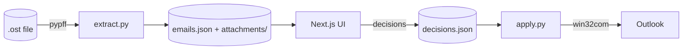

# Email Triage

Tinder-style triage UI for Outlook inboxes. Read your `.ost` file, swipe through emails (archive / save / reply / skip), then commit the archive decisions back to Outlook.

Built because clearing 600+ unread emails in Outlook itself is miserable.



## Stack

- **Next.js 15** + React 19 + Tailwind + [`motion`](https://motion.dev) — swipe card UI
- **pypff** — read-only OST/PST parser (Outlook closed)
- **pywin32** — commit archive moves to live Outlook (Windows-only)

## Setup

```bash
# python deps
pip install -r requirements.txt

# web deps
cd web && npm install
```

## Usage

**1. Extract** (Outlook closed)

```bash
export EMAIL_TRIAGE_OST="/path/to/your.ost"
python scripts/extract.py
```

Or try with fake data — no OST required:

```bash
python scripts/seed_demo.py
```

**2. Triage**

```bash
cd web && npm run dev   # http://localhost:3000
```

| Key | Action |
| --- | --- |
| `A` / swipe ← | Archive |
| `S` / swipe → | Save for later |
| `R` | Reply later |
| `␣` | Skip |
| `U` | Undo current |
| `E` / `Esc` | Expand / collapse |
| `← →` | Prev / next |

Toggle to **Decided** view to review and undecide.

**3. Apply** (Outlook open, Windows only)

```bash
python scripts/apply.py
```

Matches by `sha1(subject|sender|date)[:16]` and moves archived emails via win32com.

## Project layout

```
email-triage/
├── scripts/
│   ├── extract.py    # OST -> emails.json + attachments/
│   ├── apply.py      # decisions.json -> Outlook
│   └── seed_demo.py  # fake emails for testing
├── web/              # Next.js 15 app
│   └── app/
│       ├── page.tsx
│       └── api/{emails,decisions,img}/
└── data/             # gitignored (emails, attachments, decisions)
```

## Security

This is a **local-only single-user** tool. APIs have no auth. Bind only to `127.0.0.1`:

```bash
cd web && npm run dev -- -H 127.0.0.1
```

Do not expose port 3000 over LAN/WAN — anyone reaching it can read all emails and write decisions. Email HTML is rendered in a `sandbox="allow-popups"` iframe (no same-origin, no scripts) to neutralize hostile email content.

## Known limitations

- `/api/emails` returns the full inbox payload upfront (~7MB at 246 emails). Fine for personal use; for thousands of emails, split into list+detail endpoints.
- `decisions.json` rewrites on every keystroke (atomic + serialized — no race, but disk-noisy).
- Sent items: OST often only caches a small subset. Use Microsoft Graph for full sent mail.

## Notes

- **OST locking**: Outlook locks the .ost file while running. Close Outlook before `extract.py`.
- **Inline images**: cid: refs in HTML are extracted from MAPI attachments and served via `/api/img/{emailId}/{file}`.
- **Encoding gotcha**: pypff returns utf-16-le bytes for unicode property entries (value_type 0x001f). Decoding as utf-8 silently produces null-padded garbage — see `decode_entry()` in extract.py.
- **Sent items**: OST often only caches a tiny slice of Sent. For full sent mail use Microsoft Graph API.

## License

MIT
